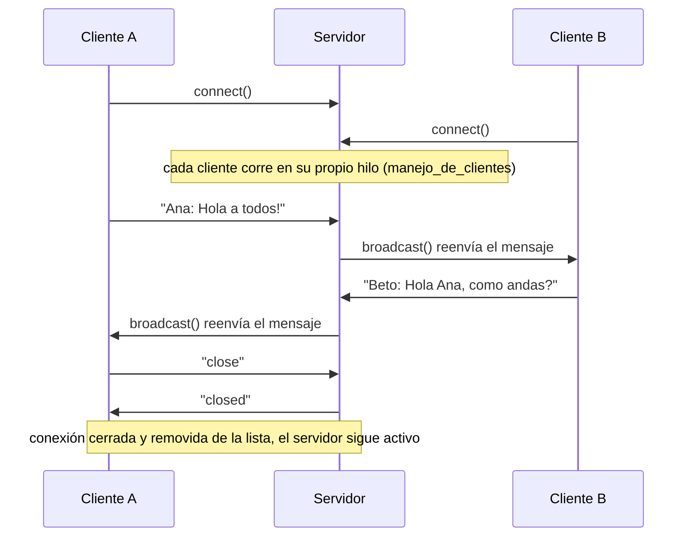
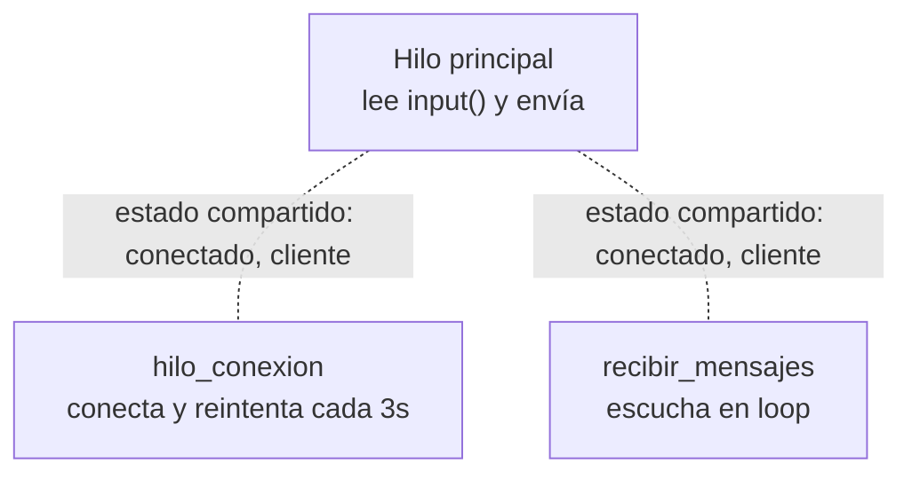

# 📡 Protocolo de Emergencia — Chat en Tiempo Real con Sockets

Aplicación de chat en tiempo real construida con **Python puro** (`socket` + `threading`, sin frameworks ni librerías de terceros), resuelta como parte del *Challenge 2: "El mundo ha olvidado cómo hablar"*.

> "Nada de bibliotecas de terceros para manejar sockets. El chat tiene que funcionar con varios clientes al mismo tiempo. Si hay lag, no es un chat. Es una carta medieval."

---

## 📋 Descripción

Un servidor TCP acepta múltiples clientes en simultáneo (uno por hilo) y retransmite (`broadcast`) cada mensaje recibido al resto de los conectados. El cliente, por consola, puede **enviar y recibir mensajes al mismo tiempo** gracias a un diseño multihilo, y se reconecta solo si pierde la conexión con el servidor.

## 🎮 Demo real

Esta transcripción sale de una prueba real contra `servidor.py`, simulando dos clientes conectados por socket:

```
[Cliente A conectado]
[Cliente B conectado]
[B recibió]: Ana: Hola a todos!
[A recibió]: Beto: Hola Ana, como andas?
[A recibió al cerrar]: closed
[Prueba finalizada sin caidas del servidor]
```

Log del lado del servidor para la misma sesión:

```
Servidor de Chat escuchando en 127.0.0.1:8000
Conexión aceptada de ('127.0.0.1', 45404)
Usuarios activos: 1
Conexión aceptada de ('127.0.0.1', 45420)
Usuarios activos: 2
Mensaje de ('127.0.0.1', 45404): Ana: Hola a todos!
Mensaje de ('127.0.0.1', 45420): Beto: Hola Ana, como andas?
Conexión con ('127.0.0.1', 45404) cerrada y removida de la lista
Mensaje de ('127.0.0.1', 45420): Beto: Sigue alguien ahi?
Conexión con ('127.0.0.1', 45420) cerrada y removida de la lista
```

👉 Después de que **Cliente A** se va con `close`, el servidor sigue en pie y **Cliente B** puede seguir mandando mensajes sin problema: no se cae aunque uno de los dos se desconecte.

## 🏗️ Arquitectura

```
chat/
├── servidor.py    # Servidor TCP: acepta conexiones, mantiene la lista de clientes y hace broadcast
├── cliente.py     # Cliente de consola: conecta, reconecta, envía y recibe en paralelo
└── README.md
```

### Servidor (`servidor.py`)

- `run_server()` abre un socket TCP en `127.0.0.1:8000` con `SO_REUSEADDR` (para no pelearse con el puerto al reiniciar) y por cada conexión aceptada lanza un **hilo dedicado** (`manejo_de_clientes`).
- Cada hilo mantiene su propio ciclo `recv()` y agrega su socket a la lista global `clientes` al arrancar.
- `broadcast(mensaje, actual_cliente_socket)` recorre esa lista y reenvía el mensaje a todos **menos** al emisor. Si el envío falla (cliente muerto), lo saca de la lista ahí mismo.
- El mensaje `"close"` es tratado como comando de desconexión prolija: el servidor responde `"closed"` y cierra ese socket puntual, sin afectar al resto.
- Cualquier error de conexión cae en el `except`/`finally` del hilo: se remueve el socket de la lista y se cierra, sin tirar abajo el servidor completo.

### Cliente (`cliente.py`)

El cliente corre **3 hilos en paralelo** para poder hablar y escuchar a la vez:

1. **Hilo principal** — lee `input()` y envía mensajes.
2. **`hilo_conexion`** — mantiene la conexión viva; si se cae, reintenta cada 3 segundos sin bloquear al usuario.
3. **`recibir_mensajes`** — escucha en loop lo que llega del servidor y lo imprime en pantalla.

Estos tres hilos se coordinan a través de dos variables globales (`cliente`, `conectado`), que funcionan como estado compartido.

### Diagrama de secuencia (broadcast)



### Hilos del cliente



## ▶️ Cómo ejecutar

Requiere **Python 3**, sin dependencias externas.

**1. Levantar el servidor** (una sola terminal):
```bash
python3 servidor.py
```

**2. Levantar uno o más clientes** (una terminal por cada uno):
```bash
python3 cliente.py
```

Cada cliente pide un nombre al arrancar. A partir de ahí, todo lo que escribas se retransmite a los demás conectados.

**Para chatear en red local (LAN)**, cambiá `server_ip = "127.0.0.1"` en `servidor.py` y `cliente.py` por la IP local de la máquina que hace de servidor (ej. `192.168.0.15`), y asegurate de que el puerto `8000` esté abierto en el firewall.

**Para salir**, escribí `close` en cualquier cliente.

## 🧯 Resiliencia y manejo de errores

| Escenario | Cómo se maneja |
|---|---|
| Un cliente se desconecta abruptamente | `recv()` devuelve vacío o lanza excepción → el hilo lo detecta, lo saca de `clientes` y cierra el socket, sin afectar al resto |
| Falla el envío a un cliente durante el broadcast | Se captura el error puntual y se remueve de la lista, sin frenar el envío a los demás |
| El cliente pierde conexión con el servidor | `hilo_conexion` detecta `conectado = False` y reintenta cada 3 segundos hasta reconectar |
| El usuario cierra la sesión de forma prolija | Se envía `"close"`, el servidor responde `"closed"` y ambos lados cierran el socket ordenadamente |
| El servidor sigue funcionando con clientes cayéndose | Cada cliente vive en su propio hilo aislado — la caída de uno no interrumpe el `accept()` loop principal |


## 👤 Autor

Desarrollado como parte del Challenge 2 — Chat en Tiempo Real con Sockets.
*(Eduardo Lugo - [linkedin.com/in/eduardo-lugo](https://www.linkedin.com/in/eduardo-antonio-lugo-ruiz-299b83396/))*
